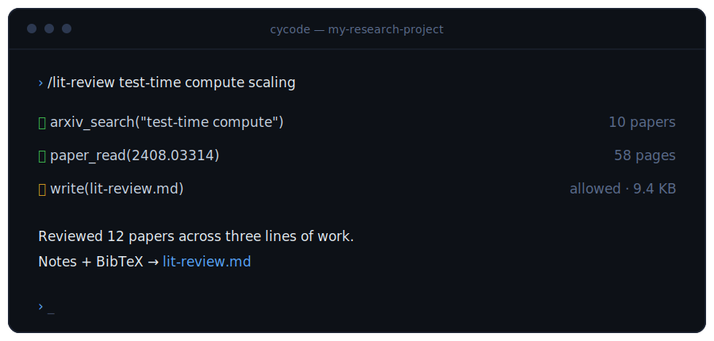
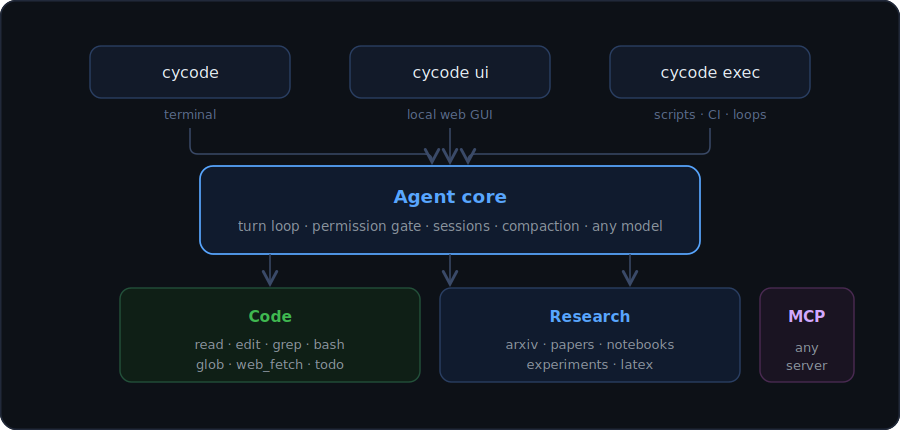

<p align="center">
  
</p>

<p align="center">
  <a href="https://github.com/ChaoYue0307/CYCode/actions/workflows/ci.yml"></a>
  <a href="LICENSE"></a>
  = 20">
  
  <a href="CONTRIBUTING.md"></a>
</p>

<p align="center">
  <a href="#quickstart">Quickstart</a> ·
  <a href="#three-interfaces-one-agent">Interfaces</a> ·
  <a href="docs/tools.md">Tools</a> ·
  <a href="docs/configuration.md">Configuration</a> ·
  <a href="docs/skills.md">Skills</a> ·
  <a href="docs/loops.md">Loops</a> ·
  <a href="#roadmap">Roadmap</a>
</p>

---

General coding agents stop at code. Research is code **plus** literature, experiments, notebooks, and papers — so CYCode makes them first-class tools, not afterthoughts:

<p align="center">
  
</p>

- 📚 **Papers** — `arxiv_search`, `paper_read` (PDF → text, page ranges), `semantic_scholar` (search + references). `/lit-review` produces structured notes with BibTeX — every citation comes from a real tool result, never from model memory.
- 🧪 **Experiments** — `exp_run` launches training scripts detached in the background; `exp_status` tails logs and extracts metrics by regex; `/watch-run` reports trends and flags divergence (NaN losses, OOM, frozen output).
- 📓 **Notebooks** — `notebook_read` / `notebook_edit` operate on `.ipynb` cells directly, preserving nbformat.
- 📄 **LaTeX** — `latex_build` compiles via latexmk/pdflatex and returns structured `file:line` errors. `/paper-draft` writes grounded in your actual results.
- 💻 **Code** — the full coding toolkit: `read`, `write`, `edit`, `glob`, `grep`, `bash`, `web_fetch` (plus optional `web_search`), with permission gating on everything and post-edit diagnostics fed back to the model.
- 🔁 **Loops** — `cycode exec "task" --json` emits machine-readable events and meaningful exit codes, designed to be driven by recurring agent loops, cron, and CI.

## Heritage

CYCode is a lean harness (~5K lines of strict TypeScript) written from scratch, deliberately combining the best ideas of the three major agent lineages. All code is original; no proprietary source was used.

| Lineage | What CYCode adopts |
|---|---|
| **Claude Code** (design patterns) | permission modes, `AGENTS.md` context files, markdown skills with slash commands, todo planning, explore subagents, context compaction |
| **Codex CLI** (Apache-2.0) | resumable JSONL session rollouts, headless `exec --json` for CI and agent loops |
| **OpenCode** (MIT) | provider-agnostic model layer, post-edit diagnostics fed back to the model |

## Install

**Download a standalone binary** — no Node required — from the
[latest release](https://github.com/ChaoYue0307/CYCode/releases/latest):

| Platform | File |
|---|---|
| macOS (Apple Silicon) | `cycode-darwin-arm64.tar.gz` |
| macOS (Intel) | `cycode-darwin-x64.tar.gz` |
| Linux (x64) | `cycode-linux-x64.tar.gz` |
| Linux (arm64) | `cycode-linux-arm64.tar.gz` |
| Windows (x64) | `cycode-windows-x64.zip` |

```sh
tar xzf cycode-darwin-arm64.tar.gz && mv cycode-darwin-arm64 /usr/local/bin/cycode
cycode --version
```

**Or build from source** (Node ≥ 20):

```sh
git clone https://github.com/ChaoYue0307/CYCode && cd CYCode
npm install && npm run build && npm link    # then: cycode
```

Optional extras used when present: `rg` (faster grep), `latexmk`, `jupyter`.
*(npm registry publication is planned.)*

## Quickstart

```sh
export ANTHROPIC_API_KEY=...   # or OPENAI_API_KEY / GOOGLE_GENERATIVE_AI_API_KEY / OPENROUTER_API_KEY
cd your-project

cycode                          # interactive terminal REPL
cycode ui                       # local web GUI at http://127.0.0.1:7833
cycode -c                       # continue the most recent session
cycode exec "run the test suite and fix any failures" --mode acceptEdits
cycode exec "/watch-run" --json # headless skill run with JSONL event output
```

In the REPL: `/help`, `/mode`, `/compact`, `/skills`, `esc` interrupts, and any `/skill-name` runs a skill.

## Three interfaces, one agent

The agent core emits events through a bus and asks for permissions through an arbiter interface — so every frontend gets identical behavior and the same security model.

| | Interface | Built for |
|---|---|---|
| `cycode` | Ink terminal REPL — streaming output, tool-call log, y/a/n permission prompts, live todo list | daily interactive work |
| `cycode ui` | local web GUI — sessions sidebar with one-click resume, markdown rendering, tool-call cards, permission dialogs, task panel. Bound to `127.0.0.1` only, works offline | reviewing and resuming sessions visually |
| `cycode exec` | one headless turn — JSONL events, meaningful exit codes, deny-by-default for anything unapproved | scripts, CI, recurring agent loops |

<p align="center">
  
</p>

## Models

Specify models as `provider/model-id` — switch providers without changing anything else:

```sh
cycode --model anthropic/claude-sonnet-4-6
cycode --model openai/gpt-5.1
cycode --model google/gemini-2.5-pro
cycode --model ollama/llama3.3              # local, via http://localhost:11434/v1
cycode --model openrouter/anthropic/claude-sonnet-4-6
```

Any OpenAI-compatible endpoint (vLLM, llama.cpp server, litellm proxy) can be added under `providers` in [config](docs/configuration.md) — handy for evaluating your own fine-tuned models as coding agents.

## Permissions

Read-only tools run freely; everything else passes a gate before executing. Four modes: `default` (ask), `acceptEdits` (file edits auto-approved, commands still ask), `plan` (read-only), `bypass` (everything approved — use with care).

Allow/deny rules use Claude Code-style patterns, and "always allow" answers persist per-project:

```jsonc
// .cycode/config.json
{
  "permissions": {
    "allow": ["bash(git *)", "bash(npm run *)", "latex_build"],
    "deny":  ["bash(rm -rf *)"]
  }
}
```

Deny rules win over everything — including read-only tools and `bypass` mode. Two more layers stack on top:

- **Hooks** — shell commands before/after tool calls that can block them deterministically (exit 2), e.g. forbid force-pushes no matter what the model decides.
- **Sandbox** (`--sandbox`) — kernel-level confinement of shell commands to the project dir + tmp (macOS Seatbelt / Linux bubblewrap, fail-closed). `cycode exec "..." --mode bypass --sandbox` is full autonomy inside a write-fence.

Full grammar, hook contract, and sandbox details in [docs/configuration.md](docs/configuration.md).

## Skills

Skills are markdown prompts with YAML frontmatter (the same shape Claude Code uses), loaded from the package, `~/.cycode/skills/`, and `<project>/.cycode/skills/` — later sources override earlier ones. Invoke with `/name args`.

Built-ins: **`/lit-review`** · **`/watch-run`** · **`/paper-draft`** · **`/repro-check`** — see [docs/skills.md](docs/skills.md) for the format and a writing guide.

## Sessions

Every interactive session is an append-only JSONL rollout under `~/.cycode/sessions/<project>/` — kill the terminal mid-task and `cycode -c` picks up exactly where it left off. Long conversations auto-compact at ~80% of the context window. `cycode sessions` lists history; `--resume <id>` reopens any of them.

## Driving CYCode from a loop

```sh
# process a task list, one isolated agent run per line
while read -r task; do
  cycode exec "$task" --mode acceptEdits --json >> runs.jsonl || echo "FAILED: $task"
done < tasks.txt
```

Each JSON line is an agent event (`tool-start`, `text-end`, `turn-end`, …) ending with `{"type":"result","text":…,"exitCode":…}` — everything a supervising loop needs to verify, retry, or escalate. Event schema and loop patterns: [docs/loops.md](docs/loops.md).

## How CYCode compares

| | CYCode | Claude Code | Codex CLI | OpenCode |
|---|---|---|---|---|
| License | MIT | proprietary | Apache-2.0 | MIT |
| Codebase | ~5K lines TS | ~500K lines | ~70 Rust crates | large TS + Go |
| Models | any (AI SDK) | Anthropic | OpenAI-first | 75+ providers |
| Research toolkit (papers/experiments/notebooks/LaTeX) | ✅ built-in | ❌ | ❌ | ❌ |
| Headless JSON mode | ✅ `exec --json` | ✅ `-p` | ✅ `exec` | ✅ `run` |
| Local web GUI | ✅ built-in | desktop app | ❌ | ✅ |
| MCP client | ✅ | ✅ | ✅ | ✅ |
| Designed to be read in an afternoon | ✅ | ❌ | ❌ | ❌ |

CYCode doesn't try to beat the big harnesses at general software engineering — it trades breadth for a sharp research focus and a codebase small enough to fully understand, audit, and modify.

## Roadmap

- [x] Standalone binaries for macOS / Linux / Windows (GitHub Releases)
- [x] Hooks (pre/post tool-use shell guardrails)
- [x] Parallel execution of read-only tool batches (incl. `explore` fan-out)
- [x] Runtime model switching (`/model`) and session token tracking
- [x] OS-level bash sandboxing (macOS Seatbelt / Linux bubblewrap, `--sandbox`)
- [ ] npm package release (`npm i -g cycode`)
- [ ] Native desktop app (Tauri) wrapping the GUI
- [ ] wandb / tensorboard native integration for `exp_status`
- [ ] LSP-based diagnostics (currently command-based)

Have an idea? [Open an issue](https://github.com/ChaoYue0307/CYCode/issues/new/choose).

## FAQ

**Why not just use Claude Code / Codex / OpenCode?**
Use them! CYCode exists for researchers who want paper/experiment/notebook/LaTeX tools built in, model freedom for agent research, and a harness small enough to hack on — and for anyone who wants to understand how coding agents work by reading one.

**Does it send my code anywhere?**
Only to the model provider you configure. Sessions, logs, and paper caches stay on disk under `~/.cycode/`. The web GUI binds to `127.0.0.1` and is never exposed to the network.

**Can I use it with my own fine-tuned model?**
Yes — point a `providers` entry at any OpenAI-compatible server (vLLM, llama.cpp, litellm) and pass `--model yourname/your-model`.

**Is it safe to run unattended?**
`exec` denies anything not pre-approved by mode or allow-rules instead of prompting. Start with `--mode acceptEdits` plus explicit `bash(...)` allow rules; treat `bypass` as a sandbox-only mode.

## Development

```sh
npm install
npm run dev          # tsx src/cli.ts
npm test             # vitest — 51 tests, no API key needed (mock model)
npm run typecheck && npm run lint && npm run build
```

Contributions welcome — see [CONTRIBUTING.md](CONTRIBUTING.md). Security reports: [SECURITY.md](SECURITY.md).

## Acknowledgments

CYCode stands on ideas from [Claude Code](https://github.com/anthropics/claude-code) (Anthropic), [Codex CLI](https://github.com/openai/codex) (OpenAI), and [OpenCode](https://github.com/sst/opencode) (SST). Built with the [Vercel AI SDK](https://github.com/vercel/ai), [Ink](https://github.com/vadimdemedes/ink), and the [MCP SDK](https://github.com/modelcontextprotocol/typescript-sdk).

## License

[MIT](LICENSE) © [ChaoYue0307](https://github.com/ChaoYue0307)
